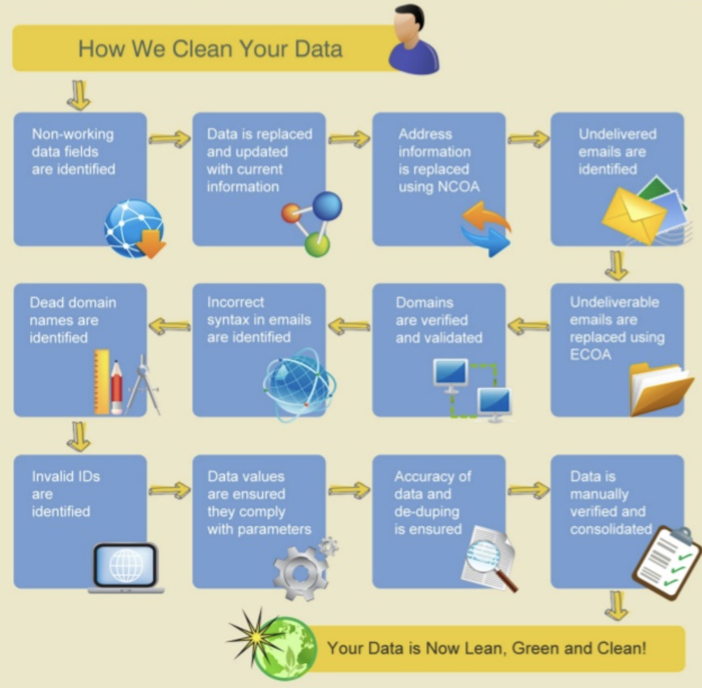
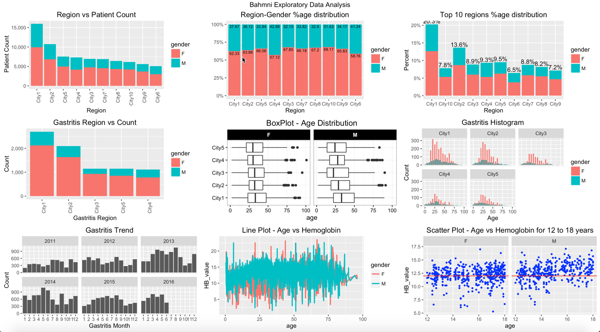
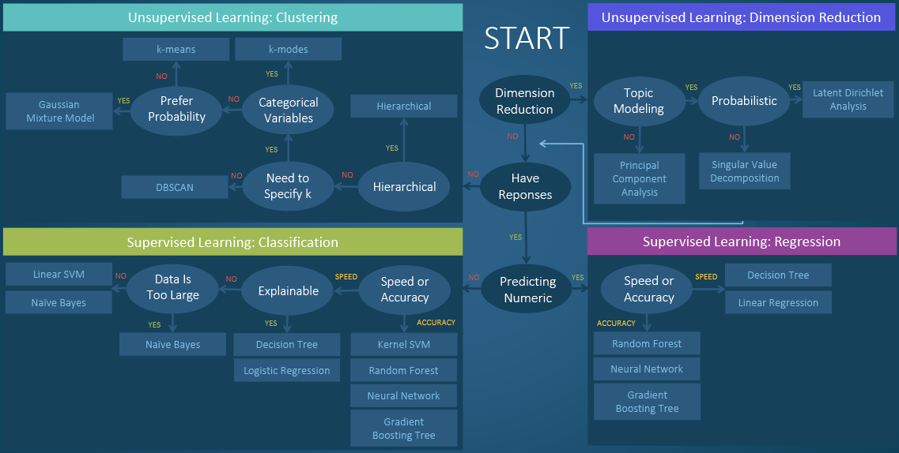
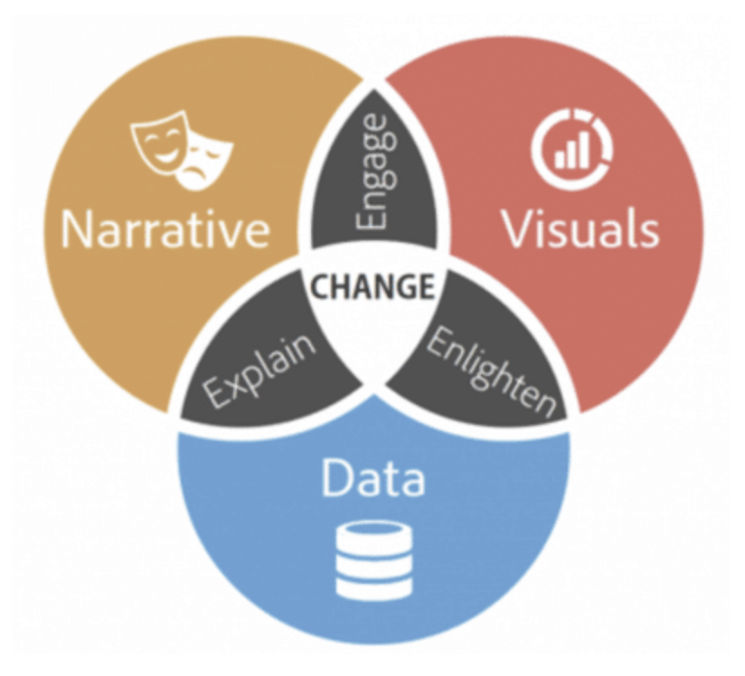

# The Data Science Process

## Introduction

In our previous lesson, we had a quick overview of different classes of problems that can be potentially solved through data analysis. It is also equally important to have a clear sense of the complete process that is typically employed to conduct such analytical experiments.  In this lesson, we will outline a generic framework for a typical data science project - from an initial business understanding of the problem domain to data modeling and data visualization for a successful conclusion and communication of the findings to business stakeholders. We will also highlight the fact that data science is an iterative process i.e. a set of findings at the end of an iteration may raise new analytical questions, hence starting the process all over again. 

## Objectives
You will be able to:
* Describe a typical data science process, highlighting the key stages involved.
* Explain why data analytics approach is considered iterative in nature.

## The Data Science Process

There is much more to data science than just selecting, applying and tuning Machine Learning algorithms. In this lesson, we will look at an overview of a typical data science process model and its key stages. We must emphasize here that there is no "standard" process model for data analytics as the process may change according to changing analytical needs. A number of such models have been proposed by data science researchers and practitioners for different analytical needs. 

In our lesson, we will look at a model proposed by [Sudeep Agarwal](http://sudeep.co) in his article:  [Understanding the Data Science Lifecycle](http://sudeep.co/data-science/Understanding-the-Data-Science-Lifecycle/). This process model follows a cyclic approach and touches upon all the key stages that we will cover in detail during the duration of our course.  For now, this model would help you answer questions like **“What do data scientists do as a part of their job?”**, or **"How do I get started as a data scientist?"**. 

Let's have a look at this process and included stages below:

In the following section, we will see an overview of the seven stages shown above and see what exactly is involved in each stage.

### 1. Business Understanding / Domain Knowledge

Before trying to solve an analytical problem, it is important that a data scientist has a clear understanding of the problem domain and the types of question(s) that need to be answered through data analysis. This stage helps us clearly define a problem and allows us to translate data questions into something actionable. Some common questions that a data scientist might be asked to answer may include (but not limited to) following:

**Regression Analysis:** (How much or how many?)

e.g. Identifying the number of new customers who are likely to do business with your company in the next quarter.

**Classification Analysis:** (Which category?) 

e.g. Classifying business documents into a number of categories e.g. legal/sales/marketing based on the contents of these document.

**Clustering Analysis:** (Which group?) 

e.g. Creating a number of a groups (segments) of your customers based on their monetary value, in order to apply differentiated marketing strategies. 

**Anomaly Detection:** (Is this normal?) 

e.g. Detecting suspicious activities of customers by a credit card company to identify potential fraud. 

**Recommendation Systems:** (Which option should be taken?) 

e.g. Recommending new products (such as movies, books or music) to existing customers based on product similarity or user similarity. 

This first stage helps us identify the key objectives of our analysis. Remember that asking the right question is considered more of an art than a science, and hence needs lots of analytical experience. After the successful completion of this stage, we will have all of the information and context required to solve a given problem.

### 2. Data Mining / Acquisition

> Data mining is a process of identifying and acquiring data of interest from different sources - databases, text files, APIs, the Internet and even printed documents. 

Once we have defined our analytical problem, the next stage of analysis is to identify and gather the data required to solve the problem. This part of the process involves thinking through what data might be needed and finding ways to obtain that data. Our data may reside at a number of locations, and in a number of different formats as shown below. 

Some of the questions that we may ask ourselves at this stage are:

* What data items do I need in order to answer the analytical question ?
* Where can I find this data ?
* How can I extract the data from data source ?
* How do I sample from this data ?
* Are there any privacy/legal issues that I must consider prior to data usage ?

It is rarely the case that the data we require simply gets handed over to us and finding the right data could become a time consuming activity. For structured data stored in a traditional SQL type database, the task becomes very simple if the analyst has some knowledge of writing SQL queries for data extraction and manipulation. In more challenging scenarios, we may have to scrape data from websites, social media or deal with unstructured or semi-structured data like written text or audio/video files. Later in this course, we will look into tools and techniques that enable us handle such challenging scenarios. 

### 3. Data Cleaning

Once we have all the raw data that we need, we usually apply some extra processing to it, before doing any analysis. This is required as data can be quite messy to start with, especially if it has not been maintained with a focus on analysis. Messy data can seriously damage the outcome of an analytical activity e.g. variables showing "null" values where they really are zero, duplicate entries in the database, missing values in key variables. In this stage, we check our data for such problems and attempt to "clean" it in order to get accurate insights.

Below are some of the common problems we may find in the raw data:

* Missing values e.g. customers records without an initial contact date.
* Corrupted values e.g. invalid entries due to typing errors.
* Time zone differences e.g. database does not take into account the different time zones of our users.
* Outliers e.g. records showing extremely high or low values as compared to the mean value. 

Data cleaning is usually the most time consuming stage within the data science process. This stage may take up to 50-80% of a data scientist's time as there are a vast number of possible problems that can make the data "dirty" and unsuitable for analysis. 

The data cleaning stage involves the development of a strategy on how to deal with these issues. Such a strategy may vary substantially between different analysis experiments, depending on the nature of problem being solved. Below is an example of setting up such a strategy, performing a number of checks before calling the data "clean". 

[This blog post](https://www.altexsoft.com/blog/datascience/preparing-your-dataset-for-machine-learning-8-basic-techniques-that-make-your-data-better/) offers a deep dive into common data collection, cleaning and preparation practices . 

### 4. Data Exploration

Once our data is clean, we can take it to the next stage where we explore its contents in more detail. The challenge here is to come up with ideas and realizations that are likely to turn into insights.

> Data exploration, also known as Exploratory Data Analysis or EDA, is the stage that follows data cleaning. Exploratory analysis helps highlight the patterns, relations, variance and bias of available data. 

Exploratory analysis may involve following activities:

* Selecting a subset of a bigger dataset for some initial insights
* Calculating some basic descriptive statistics such as the mean, the median and the mode for numerical data
* Creating a range of plots including histograms, scatter plots and distribution curves etc., to identify trends in the data
* Developing interactive visualization and applying filtering to focus on a specific segment of data 

Below we see some EDA visualization techniques employed commonly by data scientists that allow visual inspection of data contents. 

During EDA, we look at some of the most interesting patterns that can help explain certain business phenomenon e.g. "Why a particular customer segment is not buying as much as rest of segments?". EDA may help us identify a number of possible reasons for such a question e.g. customers from low sale segment do not use social media and hence do not get to learn about our products/offers, or, these customers are much older than our general audience and hence not interested in our products that are aimed at teenagers etc. 

[This Kaggle tutorial](https://www.kaggle.com/pavansanagapati/a-simple-tutorial-on-exploratory-data-analysis) provides an excellent overview of a variety of EDA techniques applied to a simple dataset. From such insights, we can begin to trace deeper patterns that can be analyzed more thoroughly in following stages.

### 5. Feature Engineering

Getting the best possible results from an analytical activity requires us to extract the maximum possible information out of the raw data for our machine learning algorithms. Feature engineering stage deals with this need by designing the best possible representation of our data under given circumstances. The better the features that we choose and prepare, the better the results we will achieve. 

A "**Feature**" is a measurable attribute of phenomenon being observed e.g. the number of rooms in a house or the sales figure for a given day. Based on the nature of analytical question asked in the first step, a data scientist may have to engineer additional features not found in the original dataset. 

> **Feature engineering is the process of using expert knowledge to transform our raw data into meaningful new features that directly address the problem we are trying to solve.** 

For example, consider using "weight" and "height" to calculate a new feature ["Body Mass Index" or (BMI)](https://en.wikipedia.org/wiki/Body_mass_index) for individuals in a given dataset. If our goal is to classify these individuals as "underweight", "healthy" and "overweight" in order to determine their health condition, the engineered BMI feature can provide us with a more suitable data representation than "weight" and/or "height". Other similar features can be engineered by employing expert knowledge for the domain under investigation. 

This stage substantially influences the performance of the predictive model that we construct in the next stage. A carefully designed feature engineering activity may lead to benefits of having flexible and simpler models demonstrating a higher level of accuracy in findings. 

For unstructured and semi-structured data types like audio, images and text, feature engineering is a common way to reduce the size of data, speed up the modeling stage and keep the whole process relatively more "explainable". An example of this is shown below:

In the Image above, on the left we see digital audio data and an engineered frequency feature called a [Spectrogram](https://en.wikipedia.org/wiki/Spectrogram). The frequency content in a spectrogram allows us to perform classification analysis on given audio data with higher level of flexibility. This technique is commonly employed by music recommendation systems like Spotify.

On the right image, we see a visual object (an apple) with engineered features including color histograms, edge detection and shape data. This technique allows us to heavily reduce the size of image data and makes us our analysis computationally less expensive. 

Modern machine learning techniques, namely Deep Learning, allows us to automatically learn such features from large datasets. [Here is an interesting article comparing different feature engineering approaches.](https://towardsdatascience.com/why-automated-feature-engineering-will-change-the-way-you-do-machine-learning-5c15bf188b96) 

### 6. Predictive Modeling

Modeling is the stage where we use mathematical and statistical approaches to answer our analytical question. 

> Predictive modeling involves using current and historical data to create a statistical model and applying probabilistic techniques to predict the likely outcome for the future. 

Predictive modeling is where machine learning and deep learning techniques come into play. Following the initial  question, we pick a predictive model to find our answer. Very often, this is not a straightforward process and there is no single right answer. Model selection includes identifying a number of factors including:

- Size of the input data 
- Nature of the input data - structured (a database) vs. unstructured (text documents)
- Quality of input data in terms of its completeness and accuracy
- Availability of computational resources
- Nature of expected output 

Based on above factors, we may choose to employ a simple regression model for routine forecasting task e.g. sales forecasting, or a highly complicated Recurrent Neural Network (RNN) for building a chatbot for our on-line customers. Selecting a model involves balancing the accuracy and the computational cost of the analysis process.[Here is an excellent resource by SAS](https://blogs.sas.com/content/subconsciousmusings/2017/04/12/machine-learning-algorithm-use/), highlighting a model selection framework.

Above, we see how a number of factors including speed, size of data, nature of data etc. drive the final selection criteria for a specific modeling approach. 

### 7. Data Visualization / Storytelling

After deriving the required results from a predictive statistical model, a data scientist crafts a compelling communication strategy to deliver the findings to business stakeholders, who may not be very proficient in the data science terminology we have seen above. "Data Storytelling" is one of key skills expected from a data scientist, which involves developing a coherent narrative around the findings from the previous stages in a logical manner. The difference between a good and a poor story is generally the difference between action and inaction towards a proposed strategy. 

> Data visualizations and visual analytics techniques are normally used to summarize and present complex findings of the analytical process in a way that is easily understandable by non-technical decision makers. 

Impressive data  storytelling require data scientist to have a strong understanding of data, narrative and quality/suitability of visual techniques employed, as highlighted in the image above [(source)](https://www.blastam.com/blog/persuasive-storytelling-with-data-visualization). There are a number of data visualization techniques available to us, ranging from simple bar graphs, line graphs and scatter plots to more complex alluvial diagrams, geo-spatial and spatio-temporal visualisations as highlighted in the image below. These techniques must be chosen according to the narrative, audience and the underlying data. 

## Data Science is an Iterative Process 

We see that the data science process shown above is iterative in nature. This means that it is an ongoing process and end of one iteration may mark the beginning of the next one. Each new finding leads to new business insights and decisions, which in turn result as new questions asked by business stakeholders. Data Science Process enforces both the importance of asking questions to guide the analysis approach and the importance of iterating on our questions and new findings. As a data scientist gathers more familiarity with data, he is able to answer more complex and directed questions and improve the quality of analysis with each iteration. 

***The Data Science Process is an innovative framework for approaching data science problems and iteratively improving the findings***.

## Summary

In this lesson, we looked at the end to end data science process to have a sense of the activities that data scientists commonly get engaged in. We covered the complete data spectrum from asking an analytical question, getting and cleaning required data, running predictive modeling techniques and communicating results to stakeholders involved. We mentioned skills and approaches generally employed for each stage. We will cover all of these stages in great detail and learn the necessary skills as we progress through the course. 

## Additional Reading 

- [Data Science Process by KDnuggets](https://www.kdnuggets.com/2016/03/data-science-process.html)
- [Gentle Introduction to Predictive Modeling](https://machinelearningmastery.com/gentle-introduction-to-predictive-modeling/)
- [Data Storytelling: The Essential Data Science Skill Everyone Needs](https://www.forbes.com/sites/brentdykes/2016/03/31/data-storytelling-the-essential-data-science-skill-everyone-needs/)
- [Measure Once, Cut Twice: Moving Towards Iteration in Data Science](https://blog.datarobot.com/measure-once-cut-twice-moving-towards-iteration-in-data-science)
