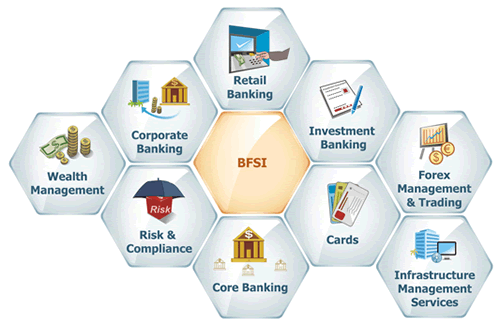

# The Data Science Process

## SWABTs
* Describe the data science process

### Overview

This lesson provides an introduction to the data science process and challenges generally faced by data scientists at different stages of this process. The first few thoughts that come to an aspiring data scientist's mind is: What? Is that a data science problem? You didn’t even mention the word ‘data’. What do I need to analyze? What does this mean?

This lesson attempts to answer these questions by providing a brief insight into the complete data science process and different activities that make up this process. 

## The Data Science Process

A common question asked by most aspiring data scientists is "How to do data science ?" or "How do I get started with data science skills". Following steps describe different stages of the data science process:

In the following section, we shall go through each of these stages and see what is involved:

### Business Understanding / Domain Knowledge

Before trying to solve a data related problem, it is imperative that a data scientist/analyst carries a clear understanding of the problem domain. The questions generally asked at this stage usually deal with are mentioned in previous lesson and summarised as below:

* How much or how many? e.g. Identifying number of new customers likely to join your company in next quarter. (Regression analysis)

* Which category? e.g. Assigning a document to a given category for a document management system. (Classification analysis)

* Which group? e.g. Creating a number of a groups (segments) of your customers based on their monetary value. (Clustering)

* Is this weird? e.g. Detecting suspicious activities of a customers by a credit card company to identify potential fraud. (Anomaly detection)

* Which option should be taken? e.g. Recommending new products (e.g. movies/books/music by Amazon) to exisating customers (Recommendation systems)

### Data Collection

After asking the analytical question and identifying objectives for your analysis, the next stage of analysis is to identify and gather the required data. 

Data mining is a process of identifying and collecting data of interest from different sources e.g. databases, text files, Internet and also printed documents etc. Some of the questions that you may ask yourself at this stage are:

* What data items do I need in order to answer my analytical question ?
* Where can I find this data ?
* How can I obtain the data from data source ?
* How do I sample from this data ?
* are their any privacy/ legal issues that I must consider prior to data usage ?

### Data Cleaning

Data cleaning and wrangling is usually the most time consuming stage within the data science process, specially in the Big data domain. This stage may take upto 50-80% of a data scientist's time as there are a vast number of possible problems that make the data "dirty" and unsuitable for analysis. Some of the problems you may see in data are follows:

* Inconsistencies in data
* Mis-spelled text data
* Outliers
* Imbalanced data
* Invalid/outdated data
* Missing data

Data cleaning stage require development of a strategy on how to deal with these issues. Such a strategy may highly vary between different analysis experiments according to the nature of analytical question. 

### Data Exploration

Data exploration or Exploratory Data Analysis is the stage that follows data cleaning. Exploratory analysis help highlight the patterns, relations, variance and bias of available data. Exploratory analysis may involve following activities:

* Selecting a subset of a bigger dataset for exploration
* Calculating basic statistics i.e. mean, median and mode etc.
* Plotting histograms, scatter plots, distribution curves to identify trends in data
* Other interactive visualisation with filtering to focus on a specific segment of data 

### Feature Engineering

A "Feature" is a measurable attribute of phenomenon being observed. Based on the nature of analystical question asked in the first step, a data scientist may have to engineer additional features not found in the original dataset. Feature engineering is the process of using expert knowledge to transform raw data into meaningful features that directly address the problem you are trying to solve i.e. creating a BMI (Body Mass Index) from the weights and heights of individuals in the dataset. This stage will directly influence the accuracy of the predictive model you construct in the next stage. 

### Predictive Modelling

Modelling is the stage where you use mathematical and/or statistical approaches are used to answer your analytical question. Predictive Modelling refers to the process of using probabalistic statistical methods to "Predict" the outcome of an event e.g. based on employee data, an organisation can develop a predictive model to identify employee attrition rate in order to develop better retention strategies.Chossing the right model could be a challenging decision as there is never a single right answer. Selecting a model involves balancing the performance and computational cost of the analysis process. Some recent approaches in predictive modelling e.g. deep learning, have been shown to offer vastly improved accuracy of results, but with a very high computational cost.

### Data Visualisation

Data Visualisation is a multidisciplinary domain in itself and borrows ideas from communication theory, psychology, statistics After deriving the required results from a statistical model, visualisations are normally used to summarise and present the findings of analysis process in a form which is easily understandable by non-technical decision makers. Data visualisation could be thought of as an evolution of visual communication techniques as it deals with "VISUAL" representation of data. A number of different data visualisation techniques ranging from bar graphs, line graphs, scatter plots to alluvial diagrams, spatio-temporal visualisations etc. 

### Conclusion and Summary

In this lesson, we looked at the data science process and different activities that data scientists engage themselves into while doing data analysis. 

